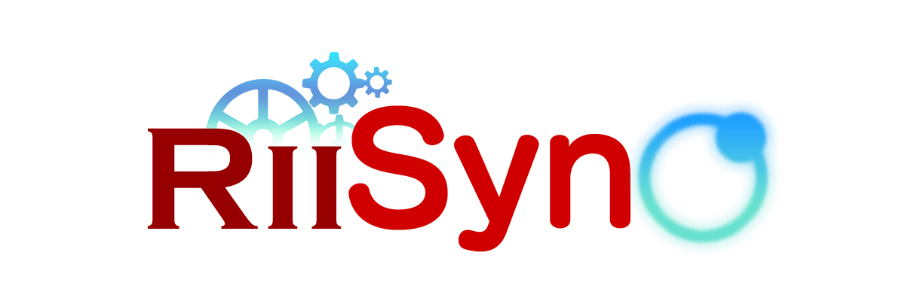

  

# RiiSync

RiiSync is an Android app that brings **GitHub, Wii mod management, Riivolution, and Dolphin** together in one place.

Instead of switching between multiple apps and manually moving files around, RiiSync gives you a single workspace to explore GitHub, manage your repositories, connect local Wii mods to Dolphin, edit Riivolution patches, and manage game artwork.

**Browse GitHub → Manage your mod → Sync it with Dolphin → Play.**

RiiSync is designed for Wii modders who use **Riivolution and Dolphin on Android**, while also providing useful GitHub features for managing and discovering projects.

---

## Key Features

### GitHub Integration

RiiSync brings many useful GitHub features directly into the app.

   * Public Repository Search: Search for public GitHub repositories directly from RiiSync.
   * User Pages: Browse GitHub user pages and explore their repositories just like on GitHub.
   * Repository Management: Access and manage your own repositories using a GitHub Personal Access Token (PAT).
   * Pull & Push: Pull changes from your repositories and push your local changes back to GitHub.
   * Branch Management: Switch between Git branches directly from the app.
   * Local Repository Management: Work with repositories stored locally on your device.

### Wii Modding & Dolphin Integration

The Modding section is designed to make connecting Wii mods to Dolphin as simple as possible.

   * Local Mod Folders: Select an existing mod folder stored on your device and connect it to Dolphin with a single click.
   * Dolphin Integration: Uses Shizuku to link your mod folders directly to Dolphin's internal directories.
   * Automatic Synchronization: Keep your mod files synchronized with Dolphin without manually copying files.
   * Live File Watcher: RiiSync continuously monitors your mod files and detects changes automatically.
   * Pull & Resync: If your mod is stored in a Git repository, changes made after a `pull` are detected by the live watcher and synchronized with Dolphin automatically.
   * Smart Relocation: Move your mod source folder without manually recreating its Dolphin link.
   * Official Dolphin & MMJR2: Supports both Official Dolphin and MMJR2 (Medard22 VBI).

### Riivolution Support

RiiSync also provides tools for working directly with Riivolution patches.

   * Riivolution XML Parsing: Detect and read Riivolution patch files from your mod.
   * Patch Editor: Modify your Riivolution patch directly from the Modding section using the built-in editor.
   * Patch Validation: Verify the integrity of Riivolution XML files before using them.

### Game Icons & Covers

RiiSync includes a dedicated artwork database for your Wii games and mods.

   * Artwork Database: Download the latest game artwork database directly from the app's Settings.
   * Animated Wii Icons: Automatically obtain high-quality animated Wii channel icons.
   * Game Covers: Download vertical game covers from GameTDB.
   * Multi-Region Support: Supports multiple regions including EN, US, IT, DE, FR, ES, NL, PT, JA, KO, and ZH.
   * Targeted Asset Discovery: Only download the icons and covers needed by your games and mods.
   * Live UI Refresh: Artwork updates are reflected in the interface without restarting the app.

### Security & User Experience

   * Hardware-Backed Security: GitHub Personal Access Tokens are securely stored using the Android Keystore system.
   * Connection Intelligence: Detects network changes and prevents actions that require an active connection.
   * Onboarding Experience: An interactive setup process helps configure permissions and verify that everything is ready.
   * Material 3 Design: Modern adaptive interface with full Light and Dark mode support.

---

## How It Works

### GitHub

Use RiiSync to search for public repositories, browse users, or connect your own GitHub account using a Personal Access Token.

If you have a Wii mod repository, you can manage it directly from RiiSync with familiar Git operations such as `pull`, `push`, and branch switching.

### Modding

You don't need a GitHub repository to use the Modding section.

Simply select a mod folder stored locally on your device and connect it to Dolphin with a single click.

RiiSync creates the required link and continuously watches the folder for changes.

### Git + Modding

For an even more powerful workflow, keep your mod inside your own GitHub repository.

After pulling new changes from GitHub, RiiSync's live file watcher detects the updated files and automatically synchronizes them with Dolphin.

This means your workflow can be as simple as:

**GitHub → Pull → RiiSync detects changes → Dolphin is updated → Play.**

### Riivolution

When needed, you can open the Riivolution patch directly from the Modding section and modify it without leaving RiiSync.

---

## Installation

1. Navigate to the [**Releases**](https://github.com/Im-Monee/RiiSync/releases) page.
2. Download and install the latest `v1.0.0` APK matching your device architecture.
3. Ensure the [**Shizuku**](https://shizuku.rikka.app/) service is active on your device.
4. Follow the interactive setup guide upon initial launch.

---

## Credits

   * Developer: Mone
   * Metadata & Assets: Nintendo, GameTDB
   * Core Libraries: JGit, Shizuku, Jetpack Compose, Coil, Jsoup.

---

  <i>Providing an integrated modding experience for the Wii community.</i>

